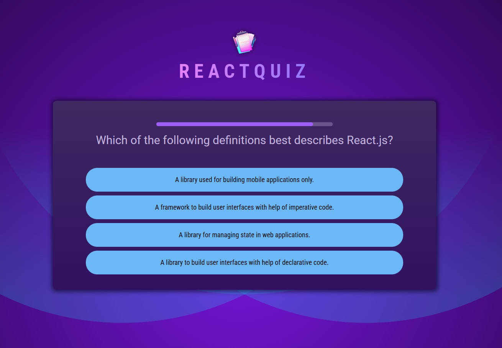

# React Quiz App

A dynamic, interactive quiz application built with React that tests users' knowledge with timed questions and provides immediate feedback.

[Show Demo](https://react--quiz-app.web.app)



## Features

- **Timed Questions**: Each question has a 20-second countdown timer
- **Interactive UI**: Visual feedback for selected, correct, and incorrect answers
- **Answer Evaluation**: Immediate feedback on answer correctness
- **Skip Option**: Ability to skip difficult questions
- **Randomized Answers**: Answer options are shuffled for each question
- **Comprehensive Summary**: Detailed results showing performance statistics
- **Progress Tracking**: Visual indication of quiz progress

## Installation

1. Clone the repository:
   ```bash
   git clone https://github.com/AvetBadalyan/React-Quiz-App.git
   cd react-quiz-app
   npm install
   npm run dev
