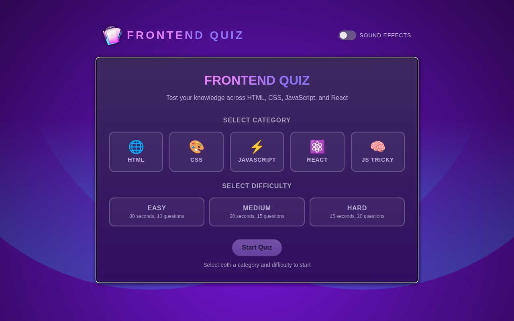

# Frontend Quiz

An interactive frontend developer quiz app built with React 19. Tests knowledge across HTML, CSS, JavaScript, and React with timed questions, difficulty levels, and high score tracking.

**[Live Demo →](https://react--quiz-app.web.app)**



## Features

- **4 categories** — HTML, CSS, JavaScript, React (95 questions total)
- **3 difficulty levels** — Easy (30s / 10 questions), Medium (20s / 15), Hard (15s / 20)
- **Topic filters** — focus on specific areas within each category
- **Timed questions** — per-question countdown with visual + audio warning at 5 seconds
- **Instant feedback** — correct answer revealed after each selection
- **High score tracking** — best score per category/difficulty saved in localStorage
- **Sound effects** — toggleable correct/wrong/warning audio
- **Keyboard navigation** — press 1–4 to select answers
- **Confetti celebration** — on new high score records

## Tech stack

- **React 19** — `useReducer` for quiz state, `useContext` for sound, custom hooks for timer and scores
- **Framer Motion** — page transitions and staggered answer animations
- **SCSS** — design tokens, BEM naming, responsive layout, dark theme
- **Vite** — build tool and dev server
- **Vitest + React Testing Library** — 158 tests across hooks, services, and screens

## Getting started

```bash
git clone https://github.com/AvetBadalyan/React-Quiz-App.git
cd React-Quiz-App
npm install
npm run dev
```

## Scripts

| Command            | Description              |
| ------------------ | ------------------------ |
| `npm run dev`      | Start dev server         |
| `npm run build`    | Production build         |
| `npm run preview`  | Preview production build |
| `npm run test`     | Run tests in watch mode  |
| `npm run test:run` | Run tests once           |
| `npm run lint`     | ESLint check             |
| `npm run format`   | Prettier format          |

## Project structure

```
src/
├── components/
│   ├── feedback/     # Confetti, HighScoreDisplay, NewRecordBadge
│   ├── layout/       # Header, AnimatedPage
│   ├── quiz/         # CategorySelector, Answers, QuestionTimer, TopicFilter
│   │   └── screens/  # StartScreen, QuizScreen, SummaryScreen
│   └── ui/           # Button, ProgressBar, Toggle
├── context/          # QuizContext (useReducer), SoundContext
├── data/             # constants, question bank (html/css/js/react)
├── hooks/            # useTimer, useHighScores, useKeyboardNavigation, useLocalStorage
├── services/         # questionService, storageService, soundManager
└── utils/            # animations, scoring, shuffle
```
